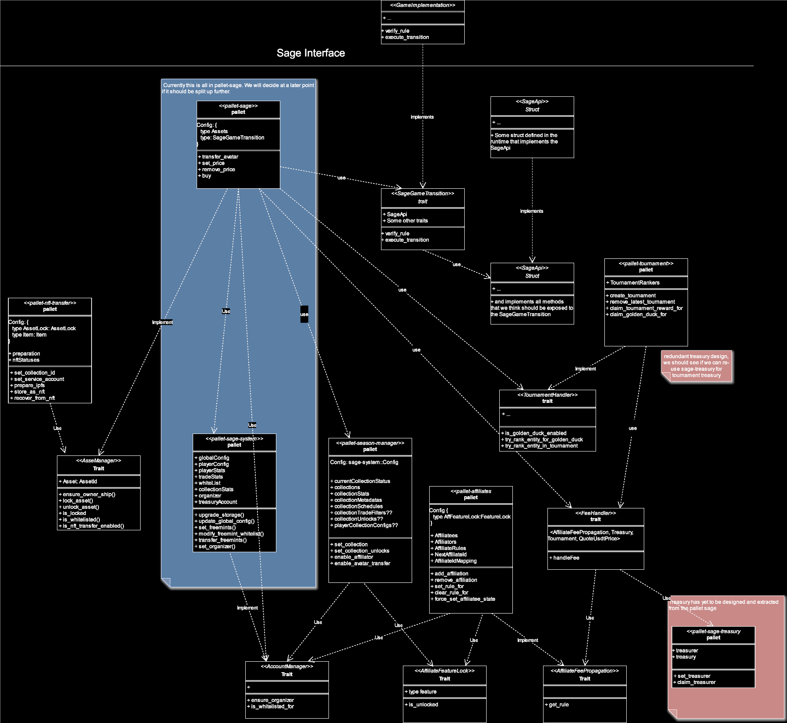

# Substrate Asset Game Engine - SAGE

Sage is the core of how we want to streamline easy and feature-rich game deployment on the Ajuna Chain.
We aim to abstract away as much of Rust and Substrate as possible, as very few game developers have a Rust
background and are often overwhelmed by Rust and Substrate.

Below is a WIP architecture of the intended Sage design. It shows that the `GameImplementation` implements exactly one
trait: the `SageGameTransition`. This trait itself has an associated type, `SageApi` (name not final), which provides
all
the facilities that the `GameImplementation` might need to create a feature-rich game. The `SageApi` will be a struct
defined in the runtime that amalgamates the different pallets and types into a concise API. In the future, this might
simply be a macro similar to the `construct_runtime` macro, as this is only boilerplate code.

